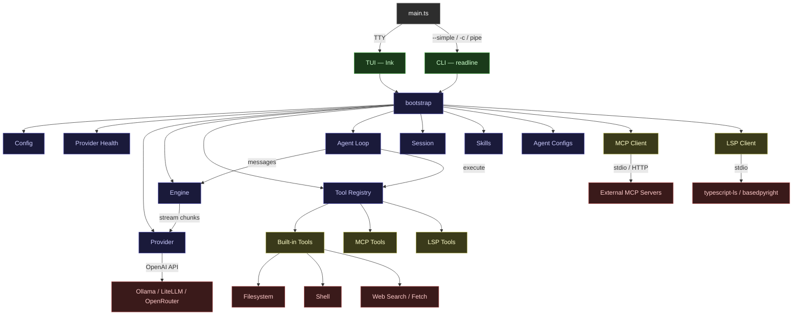
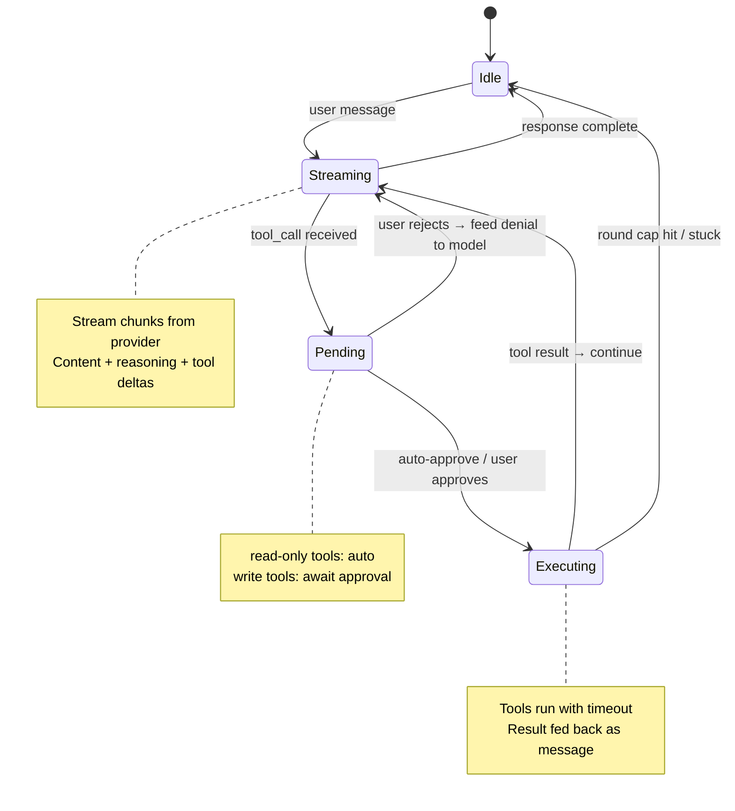
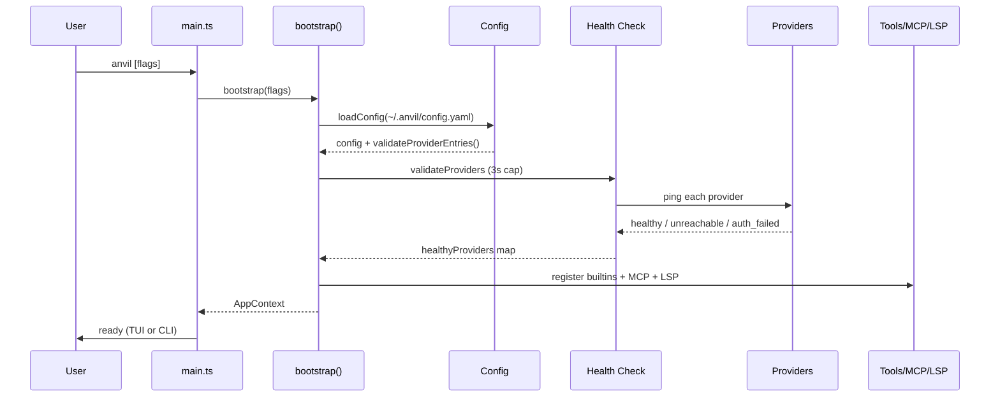

# Architecture

## System Overview



## Agent Loop State Machine



## Boot Sequence



## Module Layout

```
src/
├── main.ts           Entry — routes to TUI or CLI
├── shared/
│   └── bootstrap.ts  Orchestrates startup, creates AppContext
├── config/           YAML loader, validation, env var interpolation
├── provider/         OpenAI-compatible streaming (single implementation)
├── engine/           Message history, streaming, model switching
├── agent/            State machine — send/approve/reject/cancel
├── agents/           Agent YAML configs — guards, hooks, trust levels
├── tools/            Registry + built-in tools (fs, shell, git, web)
├── mcp/              External tool servers (stdio + HTTP transport)
├── lsp/              Language servers — diagnostics, navigation, rename
├── session/          Auto-save, resume, history browser
├── skills/           Skill discovery + parser (multi-directory)
├── web/              DuckDuckGo search + Readability fetch
├── tui/              Ink-based terminal UI (interactive picker, streaming)
└── cli.ts            Readline fallback (numbered picker, simple I/O)
```

## Provider Layer

All providers use the OpenAI-compatible chat completions API. A single implementation covers Ollama, LM Studio, llama.cpp, and any compatible endpoint.

```typescript
type StreamChunk = {
  content?: string
  reasoning?: string
  toolCall?: ToolCallDelta
  done: boolean
  usage?: { promptTokens: number; totalTokens: number }
}
```

Robustness:

- Stream timeout — abort if no chunk arrives within configured seconds
- Connection timeout — accounts for model cold-loading
- Partial tool call recovery — lenient JSON parsing for incomplete output
- Empty response detection — retry once before reporting failure
- Graceful degradation — never hang, every await has a timeout

## Agent Loop

Sequential state machine for tool-using interactions:

```
idle → streaming → pending → executing → streaming → ...
                          ↘ done/stuck → idle
```

- **Round cap**: Maximum iterations per turn (default 25)
- **Approval gating**: Side-effecting tools require user confirmation
- **Read-only tools auto-execute**: `list_dir`, `glob`, `search`, `read_file`
- **Retry on malformed tool calls**: Send error back to model, let it retry

## Tool Registry

Tools are registered with a schema, approval requirement, timeout, and execute function. Built-in tools cover file operations, shell, git, and web. MCP tools are merged into the same registry at runtime.

```typescript
type Tool = {
  name: string
  description: string
  schema: JsonSchema
  needsApproval: boolean
  timeout: number
  execute: (args: unknown, projectRoot: string) => ResultAsync<string, ToolError>
}
```

## Agent Configs

YAML definitions in `.anvil/agents/` control tool access, auto-approval, path guards, command regex filters, and lifecycle hooks per agent profile.

## Error Handling

All fallible operations return `Result<T, E>` or `ResultAsync<T, E>` (neverthrow). No thrown exceptions in business logic. Errors are typed discriminated unions.

## Configuration

YAML config at `~/.anvil/config.yaml` — provider endpoints, default model, timeouts, context size, and display preferences. Created automatically on first run.
